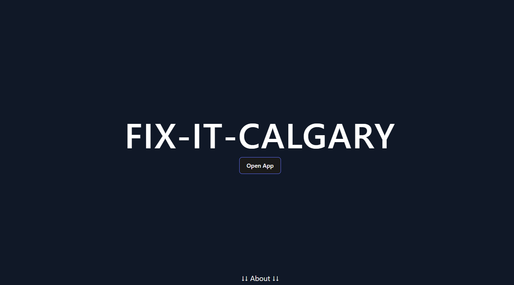
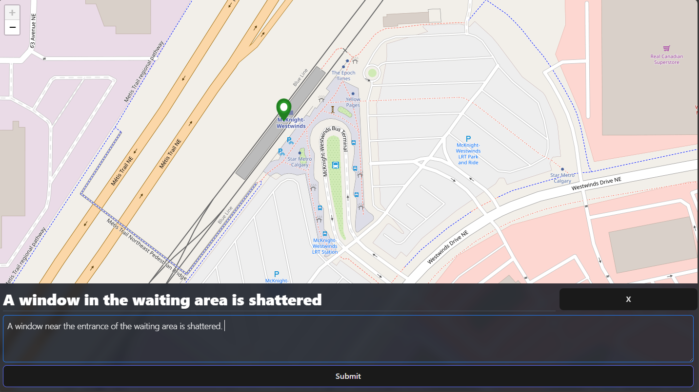

# Fix It Calgary

## Overview
Fix It Calgary is a web-based, issue reporting platform built during **Hack the Change 2025**. The application allows users to pin locations on a map and write reports describing issues they encounter in specific areas, enabling awareness of community concerns.

The project was designed and built within a 24-hour window, prioritizing rapid prototyping, core functionality, and usability under tight time constraints.

## Features
- Interactive map for selecting and pinning locations
- User-submitted issue reports with written descriptions
- Location-based display of reported issues
- Simple, responsive user interface designed for fast iteration

## Tech Stack
- **Frontend:** React, Vite
- **Styling:** Tailwind CSS
- **Hosting / Deployment:** AWS

